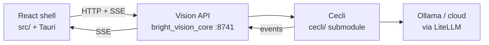

# BrightVision

**Website:** [brightvision.digitaldefiance.org](https://brightvision.digitaldefiance.org)

<div align="center">
  
</div>

A **local-LLM-first** desktop IDE (Tauri + React) for AI-assisted coding — spec-driven tasks, superproject git, built-in editor, and a headless agent you control from the UI (never the terminal TUI).

**Built in partnership with the [Cecli](https://cecli.dev) team** — coding agent from [dwash96/cecli](https://github.com/dwash96/cecli). BrightVision adds **`bright_vision_core`** (Vision HTTP/SSE on `:8741`) so React talks to sessions over the API. Agent: submodule **`cecli/`** → [Digital-Defiance/cecli](https://github.com/Digital-Defiance/cecli).

<p align="center">
  
</p>
<p align="center"><em>Chat — Thinking/Answer streaming, fenced code, and rendered Mermaid diagrams</em></p>

## Architecture



| Layer | Role |
|-------|------|
| **Head** | Chat, Tasks, Terminal, Git, Editor, Settings — left rail, not a VS Code clone |
| **Vision API** | Sessions, todos, git superproject, SSE → `src/ipc/events.ts` |
| **Cecli** | Models, coders, tools, slash commands, agents, MCP |
| **Local LLM** | Rust panel starts Ollama; turns run in Python core |
>>>>>>> Stashed changes

## What BrightVision does

| Pillar | Highlights |
|--------|------------|
| **Chat** | Streaming Thinking/Answer, **Mermaid** + highlighted fences, proposed edits, confirm/queue/stop, `/clear`, suggested-files tray, model router, agent chips |
| **Tasks** | EARS/spec workflow — todos, layered specs, generate/refine, Implement with active task |
| **Git** | Status, diffs, commit graph, stage/commit/undo (desktop) |
| **Editor** | CM6 tabs, resizable file explorer, git badges, open-from-chat, optional language packs |
| **Local LLM** | Ollama panel, hopper preload, ping, resource overlay (CPU/RAM/GPU in rail) |
| **Timing** | Live Response/Think bar, per-model ETA, Settings history (TPS, resources, CSV) |
| **Agents** | `/agent`, `/invoke-agent`, `/spawn-agent`, `/reap-agent` + sub-agent registry |

Full catalog: **[docs/FEATURES.md](docs/FEATURES.md)** · backlog: **[docs/ROADMAP.md](docs/ROADMAP.md)**

## Screenshots

<table>
<tr>
<td width="50%">

**Tasks — spec-driven work**


</td>
<td width="50%">

**Editor — tabs + explorer**


</td>
</tr>
<tr>
<td width="50%">

**Git — graph & working tree**


</td>
<td width="50%">

**Activity bar + confirm**


</td>
</tr>
<tr>
<td colspan="2">

**Settings — timing history & resource overlay**


</td>
</tr>
</table>

## Quick start

### macOS (Homebrew)

```bash
brew tap digital-defiance/tap
brew install brightvision
```

### From source

```bash
git clone https://github.com/Digital-Defiance/BrightVision.git
cd BrightVision
git submodule update --init cecli
yarn install
source activate.sh
yarn tauri dev
```

1. Install [Ollama](https://ollama.com/) and copy `local-llm.env.example` → `local-llm.env` (`DATA_MODEL`; optional `FAST_MODEL` / `HEAVY_MODEL` / `MODEL_ROUTER` — [docs/LOCAL_LLM.md](docs/LOCAL_LLM.md))  
2. **Terminal → Start** (Vision API on `:8741`)  
3. **Chat** when the session is live  

## Tech stack

- **Shell**: Tauri v2 (Rust) + React 18 + TypeScript + Vite + MUI v6  
- **Engine**: **[Cecli](https://cecli.dev)** (`cecli/`) + **Vision API** (`bright_vision_core/` in this repo)  
- **Tests**: `yarn test:fast` · `yarn test:local` · [TESTING.md](docs/TESTING.md)  

## Configuration

**Settings** — model, workspace, fonts, timing stats, suggested files, model hopper, editor languages, agents (`subagent_paths` in cecli config).

**Agents (cecli)** — define sub-agents as `*.md` under paths in `.cecli.conf.yml`; use chat **Agents** chips or `/invoke-agent reviewer …`. See Settings → Agents & sub-agents.

## Documentation

| Doc | Topic |
|-----|--------|
| [FEATURES.md](docs/FEATURES.md) | Product feature catalog |
| [ROADMAP.md](docs/ROADMAP.md) | Status & fix order |
| [UPSTREAM_CECLI.md](docs/UPSTREAM_CECLI.md) | Cecli submodule + Vision API layout |
| [LOCAL_LLM.md](docs/LOCAL_LLM.md) | Ollama & local panel |
| [SPEC_DRIVEN_DEV.md](docs/SPEC_DRIVEN_DEV.md) | Tasks workflow |
| [IPC.md](docs/IPC.md) | HTTP API & SSE |
| [DEVELOPMENT.md](docs/DEVELOPMENT.md) | Dev setup |
| [TROUBLESHOOTING.md](docs/TROUBLESHOOTING.md) | Stuck sessions, `:8741` |
| [TESTING.md](docs/TESTING.md) | Test matrix |

## License

MIT — see `LICENSE`. Copyright (c) 2026 Digital Defiance, Jessica Mulein

## Contributing

Read **ROADMAP.md** before substantive work. Open issues with repro steps (workspace path, expected vs actual).
