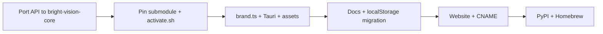

# BrightVision pivot plan

> **Current layout:** [UPSTREAM_CECLI.md](./UPSTREAM_CECLI.md). This file is a rebrand/port checklist, not the active architecture doc.

Rebrand in place in **this repo** and port the Vision HTTP/session layer onto [cecli](https://github.com/dwash96/cecli).

## Strategy: outer repo stays put

| Piece | Approach |
|-------|----------|
| **This repo** (`aider-vision/`) | Work **in place** — rebrand strings, assets, submodule pointer, `activate.sh`. No requirement to rename the folder until you want GitHub redirects. |
| **`bright-vision-core`** | **Lift and shift** — rsync Vision modules from `aider-vision-core`, then wire imports to `cecli/`. |
| **`aider-vision-core`** | Keep submodule until port works; then `git submodule deinit` and remove from `.gitmodules`. |

Cherry-picking shell commits into `bright-vision-core` is wrong (UI/docs). Cherry-picking `aider-vision-core` commits onto cecli history will **not** apply.

**Instead:** merge **file-by-file** with tiers — see **[CORE_FILE_MERGE.md](./CORE_FILE_MERGE.md)** and `python3 scripts/compare-cores.py`. Optional bulk Tier 1 copy: `scripts/port-vision-core-to-bright.sh --apply`.

## Current state (May 2026)

| Piece | Today | Target |
|-------|--------|--------|
| Desktop shell | This repo | BrightVision branding in place |
| Engine submodule | `aider-vision-core` → `aider_vision_core` | **Remove** after port |
| New engine submodule | `bright-vision-core` → raw **cecli** today | `bright_vision_core` + ported Vision API |
| Website | `docs/index.html` | Rebuild (rewrite, not cherry-pick) |
| PyPI | `aider-vision-core` | `bright-vision-core` |
| Homebrew | `aider-vision` cask | `brightvision` cask |

## What the shell actually needs from core

These modules exist only under `aider-vision-core/aider_vision_core/` today and must land on cecli (renamed package):

| Module / behavior | Used by shell |
|-------------------|---------------|
| `http_api.py`, `http_auth.py` | Tauri spawns `vision_serve.py` → SSE on `:8741` |
| `session.py`, `vision_runtime.py` | Turn lifecycle, events |
| `vision_serve.py`, `cli_serve.py` | Entrypoints |
| `git_workspace.py`, `RepoSet` | Submodule / superproject workspace |
| `workspace_todos.py`, `todo_*` | Tasks tab |
| `headless_stdio.py`, `brand.py` | No TUI in chat; product strings |
| `scripts/vision_serve.py` | Rust `main.rs` resolves engine script path |

Cecli already has active development (agents, `/merge`, skills). Port Vision layers **on top of current cecli `main`**, then rename package → `bright_vision_core` with console scripts `bright-vision-core`, `bright-vision-core-serve`.

## Recommended phases

### Phase A — `bright-vision-core` (blocking) — rsync lift

From this repo:

```bash
./scripts/port-vision-core-to-bright.sh              # dry-run
./scripts/port-vision-core-to-bright.sh --apply      # layered port (recommended)
./scripts/port-vision-core-to-bright.sh --apply --full-tree   # whole aider_vision_core/ copy
```

**Do not rsync over `cecli/`** — cecli stays the agent/coder base; Vision code lands in `bright_vision_core/` beside it.

After `--apply`, commit on **`bright-vision-core`** and:

1. **Import surgery** — `bright_vision_core` imports `cecli.*` for coders, `llm`, `repo`, etc.
2. **pyproject.toml** — package `bright_vision_core`, scripts `bright-vision-core-serve`.
3. **Wire session** — HTTP/SSE events still match `src/ipc/events.ts` in the outer repo.
4. **pytest** — `tests/basic/test_http_api.py`, `test_git_workspace.py`.
5. **PyPI** — publish `bright-vision-core` when green.

Until `bright-vision-core-serve` works, keep `aider-vision-core` in `activate.sh`.

### Phase B — Outer repo in place (submodule swap + paths)

1. Pin `bright-vision-core` @ SHA that passes HTTP smoke tests.
2. `git submodule deinit -f aider-vision-core` and remove from `.gitmodules`.
3. `activate.sh`, `requirements-core.txt`, `package.json` — `pip install -e bright-vision-core`, script paths.
4. `src-tauri/src/main.rs` — `bright-vision-core/scripts/vision_serve.py`.
5. Env vars — `BRIGHT_VISION_*` with optional aliases for `AIDER_VISION_*` one release.

### Phase C — Product rebrand (this repo, can overlap B)

Central constants in `src/brand.ts` (already the right pattern):

| Constant | New value |
|----------|-----------|
| `PRODUCT_VISION` | `bright-vision` |
| `PRODUCT_CORE` | `bright-vision-core` |
| `DISPLAY_VISION` | `BrightVision` |
| `DISPLAY_CORE` | `Cecli` |
| `DISPLAY_MONOGRAM` | `BV` |

Then mechanical pass:

- `src-tauri/tauri.conf.json` — `productName`, `identifier` `com.digitaldefiance.bright-vision`, window title.
- `package.json` — `"name": "bright-vision"`.
- `src-tauri/Cargo.toml` — crate / bundle name.
- Logos — `assets/bright-vision-logo.svg`, `assets/BrightVision.icns`, copy into `src/assets/brand/` and Tauri `icons/`.
- `localStorage` keys — `aider-vision-*` → `bright-vision-*` with one-time migration in loaders.
- Docs, `AGENTS.md`, e2e copy, GitHub URLs.

### Phase D — Website (high conflict risk)

`docs/index.html` is large and still Aider-branded. **Do not cherry-pick** shell commits into the site.

1. New IA: hero (BrightVision + cyan/magenta logo), install (Homebrew + Ollama + built-in Local LLM), docs links.
2. `docs/CNAME` → `bright-vision.digitaldefiance.org` (or your chosen host).
3. Replace hero art with `assets/bright-vision.png` / logo SVG.
4. Links to `Digital-Defiance/BrightVision`, `bright-vision-core`, homebrew-tap cask `brightvision`.

### Phase E — Distribution

| Channel | Action |
|---------|--------|
| **PyPI** | New project `bright-vision-core`; deprecate `aider-vision-core` README pointer |
| **Homebrew** | Cask `brightvision`; retire or alias `aider-vision` / `bright-vision` |
| **GitHub** | Repos `Digital-Defiance/BrightVision`, `Digital-Defiance/BrightVision-core`; archive legacy `aider-vision*` |
| **Discord / README badges** | Update after rename |

## rsync vs cherry-pick

| Approach | Use for |
|----------|---------|
| **`./scripts/port-vision-core-to-bright.sh`** | Copy known Vision files into `bright-vision-core` |
| **`git cherry-pick`** | **Avoid** between aider-vision-core and cecli histories |
| **Rebrand in outer repo** | `rg` / `brand.ts` / docs — in place, no repo move required |
| **Website** | Rewrite `docs/index.html` — conflicts guaranteed if you cherry-pick app commits |

## Suggested order of execution



## Autonomous execution plan

**Agent source of truth:** [CECLI_MIGRATION_ROADMAP.md](./CECLI_MIGRATION_ROADMAP.md) — phased gates, session plan, exit checklist, blockers log. The agent runs this end-to-end until Gate A4/B5 pass; user only needed for publish/rename/dogfood sign-off.

## Immediate next steps

1. **Start migration:** follow [CECLI_MIGRATION_ROADMAP.md](./CECLI_MIGRATION_ROADMAP.md) Phase 0 → A1.
2. **Dry-run rsync:** `./scripts/port-vision-core-to-bright.sh`
3. **Apply on a branch inside `bright-vision-core`:** commit there after `--apply`; fix cecli imports.
4. **Smoke:** `cd bright-vision-core && pip install -e . && bright-vision-core-serve` (once entrypoints exist).
5. **Outer repo:** pin submodule + `activate.sh` only when Gate A4 passes; rebrand shell in parallel (Phase C).

## Risk notes

- **Event/schema drift** — cecli may emit different progress/token events; audit `processStore.tsx` + `src/ipc/events.ts` after first integrated run.
- **Model strings** — cecli may use different defaults; Settings defaults stay in `src/ipc/config.ts`.
- **Legal** — keep Apache notices; credit cecli upstream in core README.
- **Users** — one release with env aliases (`AIDER_VISION_HEADLESS` → `BRIGHT_VISION_HEADLESS`) reduces breakage.

## Assets (already in tree)

- `assets/bright-vision-logo.svg`, `assets/bright-vision.png`, `assets/BrightVision.icns`
- `assets/BrightVision.icon/`, iOS icon set under `assets/BrightVision-iOS-Dark-*`

Wire these in Phase C before publishing the website.
